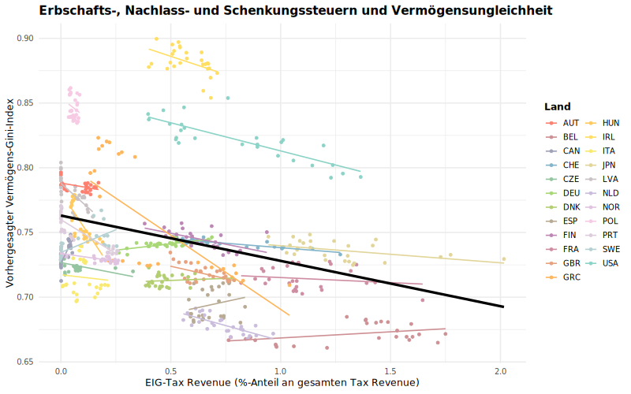

# From Tax To Equality

## Overview

I investigated the impact of diverse tax policies on wealth inequality by analyzing macro-country data sourced from various reputable outlets. Employing a multiple linear fixed-effects panel model, I scrutinized data spanning over 25 OECD countries and approximately 25 years. This approach allowed for a comprehensive understanding of the intricate relationship between tax policies and wealth distribution dynamics.

## Using the quarto document (HA_Justice.qmd) in RStudio
The qmd. should be able to import the final dataset "equaltax_balanced.csv" from the directory when running in RStudio and perform all calculations. In addition, the results of the calculations can be viewed in the HTML document and all steps can be retraced. During the editing process, various data sets were tested in different configurations. Remnants of these are still present in the code. The correct data set used for the analysis was created at the end of the "Data Preparation" chapter. This can be easily imported from chapter 3 "Descriptive Statistics" and used for all subsequent analyses. **The preparation code therefore does not need to be executed separately and due to the file size restrictions of GitHub some of the original data files are not part of the repository.
If you want them, feel free to contact me.**

> [!IMPORTANT]
> The entire folder **"Schwarz_TaxtoEquality_HA-Replication "** must be opened as a project in R and it must have been completely downloaded beforehand. After downloading the folder, the **"HA_Justice.Rproj "** file (R project) must therefore be opened. The **HA_Justice.qmd** file (Quarto document) can then be opened and used within RStudio under "**Files**".